# カオス・情報理論・輸送構造 実験メモ

## 目的

N体系・カオス系に対して、

* Lyapunov指数
* OTOC
* KSエントロピー
* symbolic entropy
* 圧縮複雑性
* predictive information
* transport network
* fractal dimension

などを測定し、

---

# 「カオスとは何か」

を、

* 情報論
* 幾何
* 輸送
* 因果性

の観点から整理する。

---

# 基本仮説

## 仮説1

カオスは単なるランダム性ではない。

---

## 仮説2

chaotic dynamics は：

* burst
* transport channel
* intermittent instability
* predictive structure

を持つ。

---

## 仮説3

edge-of-chaos 近傍で：

* complexity
* predictive information
* causal organization

が最大化される。

---

# 系

主に：

* weak chaos
* intermediate
* strong chaos

の3分類。

Lyapunov指数 λ を制御。

---

# 実験概要と直下出力の図

## 実験設定

`n_body_run_summary.txt` の集計値にもとづく今回の基本設定は次の通り。

* 対象系: planar 3-body gravitational system
* サンプル数: 49 orbit
* 積分刻み: $dt = 0.01$
* Lyapunov 推定: 9000 step, discard 1400 step, Benettin renorm 18 step
* カオス強度の分類: positive tertiles
* weak chaos の閾値: $\lambda_1 \le 0.0682$
* strong chaos の閾値: $\lambda_1 \ge 0.0745$
* 主な観測量: $\lambda_1$, KS entropy, compression complexity, permutation entropy, OTOC, coarse-grained entropy production, mutual information, transfer entropy

この節では、`N_body_complexity` 直下に出力された図を、後続の詳細メモを読むための章立てとして並べ直す。

---

## 第1章 カオス強度と複雑性の全体像

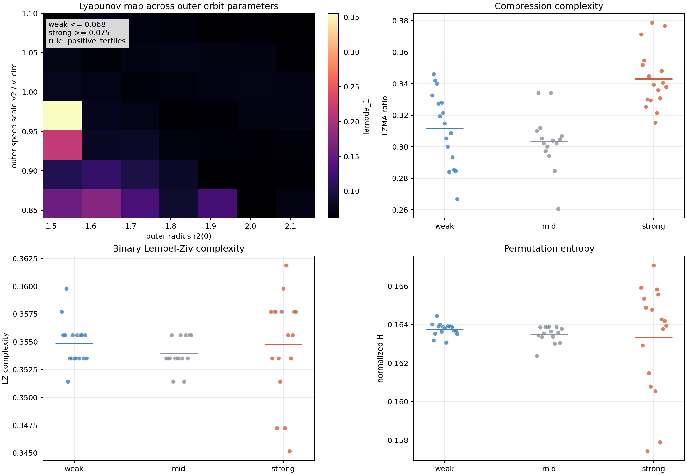

図: `n_body_chaos_complexity.png`。左上は外側軌道パラメータ平面上の Lyapunov map、右上は LZMA ratio、左下は binary Lempel-Ziv complexity、右下は permutation entropy の群比較。

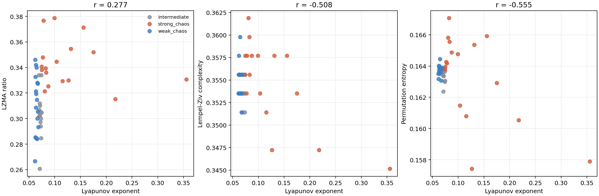

図: `n_body_lyapunov_scatter.png`。Lyapunov 指数と各複雑性量の散布図で、相関の符号と強さを直接見るための図。

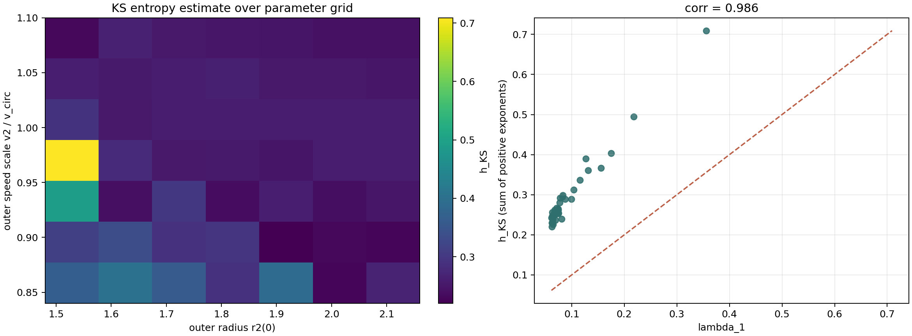

図: `n_body_ks_pesin.png`。左はパラメータ平面での KS entropy、右は $h_{KS}$ と正の Lyapunov 指数和の対応。

### この章で見ること

* strong chaos 群では LZMA ratio が weak chaos より高く、平均でも weak 0.3117 に対して strong 0.3431 まで上がる。
* ただし Lempel-Ziv complexity と permutation entropy は Lyapunov 指数と負相関で、単純な「乱雑さの増加」では整理しきれない。特に相関はそれぞれ $r \approx -0.508$, $r \approx -0.555$。
* KS entropy は Lyapunov 指数和と $r \approx 0.986$ で強く整合し、まず不安定性の基礎指標としては Pesin relation 的な対応が成り立っている。
* パラメータ平面では $r_2(0) \approx 1.5$, $v_2 / v_{\mathrm{circ}} \approx 0.95 - 0.98$ 近傍に強い不安定性が現れ、以後の図で見る burst や scrambling の背景になる。

### 対応する詳細節

* 5. compression complexity
* 6. symbolic KS entropy
* 7. KS entropy vs Lyapunov
* 8. full Lyapunov spectrum

---

## 第2章 スクランブリングと butterfly front

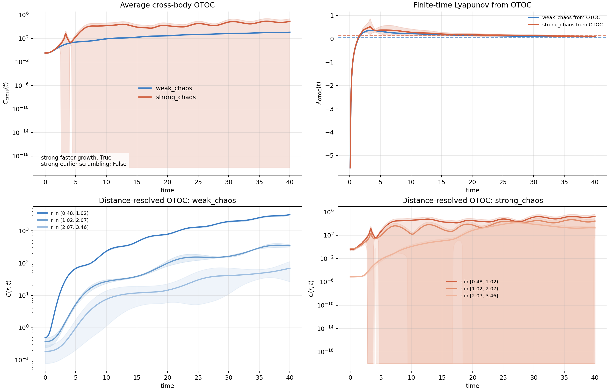

図: `n_body_otoc.png`。上段は平均 cross-body OTOC と OTOC 由来の有限時間 Lyapunov 指数、下段は weak/strong chaos それぞれの距離分解 OTOC。

### この章で見ること

* strong chaos は OTOC の立ち上がりそのものは速く、$\lambda_{\mathrm{OTOC}}$ は weak の 0.1299 に対して strong で 0.2181 まで増える。
* それでも平均 scrambling time は weak 27.82、strong 28.02 で大差がなく、「成長が速いこと」と「閾値到達が早いこと」は今回の窓では一致しない。
* 距離分解 OTOC では weak chaos の方が front が滑らかで、strong chaos はより急峻に増幅する。したがって strong chaos でも front が消えるのではなく、coherent front がより強く歪みながら進むと読むのが自然である。

### 対応する詳細節

* 1. OTOC / scrambling
* butterfly front

---

## 第3章 間欠性とエントロピー生成

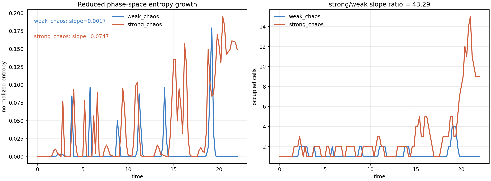

図: `n_body_entropy_production.png`。左は reduced phase-space entropy growth、右は occupied cells の時間発展で、weak/strong chaos の burst 性を比較している。

### この章で見ること

* coarse-grained entropy production の傾きは weak chaos の 0.0017 に対して strong chaos で 0.0747 となり、strong/weak slope ratio は 43.29 に達する。
* weak chaos ではほぼゼロ近傍に張り付く時間が長いのに対し、strong chaos では後半に大きな正の burst がまとまって現れ、occupied cells も一気に増える。
* したがって entropy 生成は一様な拡散ではなく、軌道の特定局面に集中的に起こる event-driven process と見なすのが妥当である。

### 対応する詳細節

* 2. finite-time Lyapunov exponent
* 3. entropy production
* 4. Local entropy production map
* 17. diffusion coefficient

---

## 第4章 情報流と予測可能性

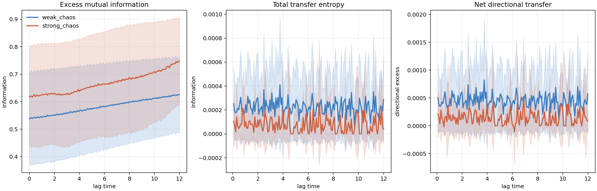

図: `n_body_information_flow.png`。左は excess mutual information、中は total transfer entropy、右は net directional transfer の lag 依存性。

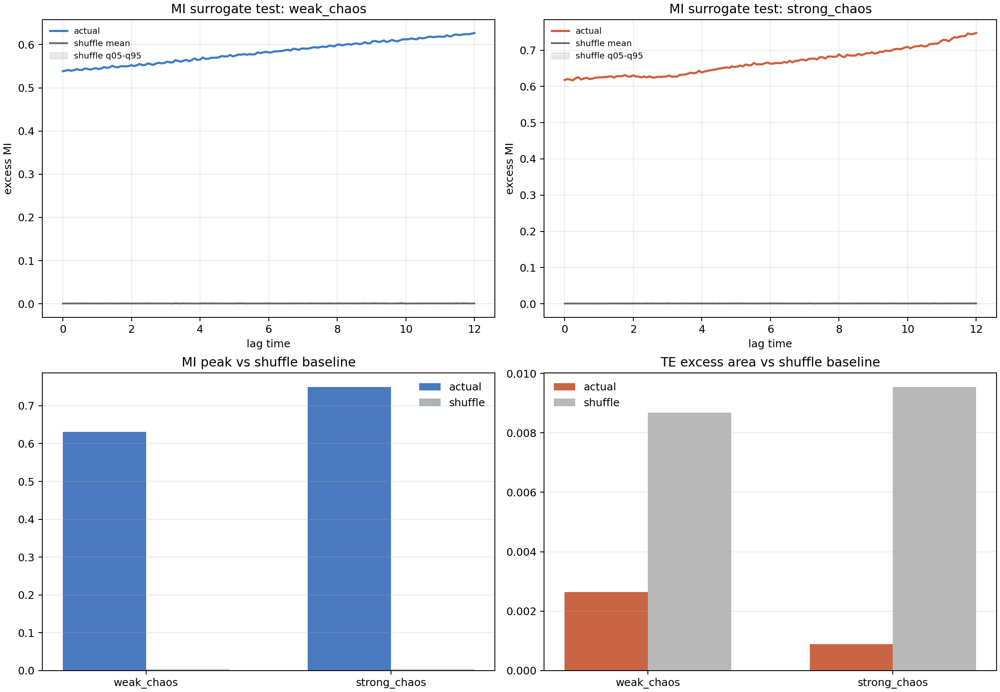

図: `n_body_shuffle_surrogate_test.png`。上段は weak/strong chaos の MI と shuffle baseline の比較、下段は MI peak と TE excess area のサロゲート比較。

### この章で見ること

* MI peak lag は weak 11.28、strong 11.20 とほぼ同じだが、MI peak excess は strong の方が大きく 0.7500、weak は 0.6311 である。
* 一方で MI area は weak 10.9592、strong 10.5435 で weak の方がやや広く、TE total area も weak 0.0026 に対して strong 0.0009 と小さい。つまり strong chaos は情報の局所的な立ち上がりは強いが、長く持続する予測可能性や方向性はむしろ弱い。
* shuffle surrogate では MI は actual が baseline を大きく上回る一方、TE は current estimator では shuffle baseline より小さい。したがって「記憶構造は強く見えるが、方向付き因果流はまだ保守的に読むべき」という整理になる。

### 対応する詳細節

* 12. Predictive information / AIS
* 13. Statistical complexity
* 14. causal emergence proxy
* 15. transport network

---

## 第5章 ノイズ比較と粗視化の頑健性

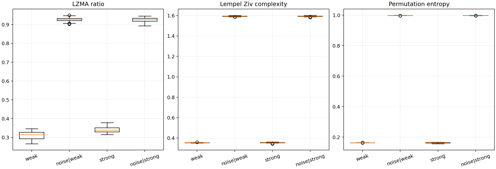

図: `n_body_noise_comparison.png`。weak/strong chaos と、それぞれに対応する random noise surrogate の LZMA ratio, Lempel-Ziv complexity, permutation entropy を比較した図。

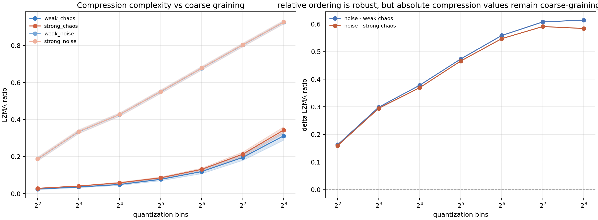

図: `n_body_coarse_graining.png`。左は quantization bins に対する LZMA ratio、右は noise との差分で見た coarse-graining 依存性。

### この章で見ること

* permutation entropy は chaos 軌道でおよそ 0.16 だが、noise surrogate では 0.998 近くまで上がる。したがって chaotic orbit は iid noise ではなく、かなり強い構造を保っている。
* Lempel-Ziv complexity は noise と chaos でほぼ別スケールに分離し、compression ratio でも noise が常に大きい。これは「強カオスでも完全ランダムではない」という基本仮説の直接的な根拠になる。
* coarse-graining を 4 から 256 bins まで変えても strong chaos の LZMA ratio が weak chaos を上回る順序は保たれる。絶対値は coarse-graining 依存だが、相対順位は頑健である。

### 対応する詳細節

* 5. compression complexity
* 6. symbolic KS entropy
* 16. multi-scale entropy

---

## 読み方

* 上の第1章から第5章は、`N_body_complexity` 直下の出力図を読むための要約である。
* 以下の節番号付きメモは、追試や仮説の書き下しを残した詳細ログで、章との対応は各章末の一覧を見れば追える。
* 全体としては、strong chaos は「常に一様に乱れている状態」ではなく、burst・scrambling・情報の局所立ち上がりが偏って現れる structured intermittent dynamics として整理できる。

---

# 追加実験: chaos_transport_analysis の結果

## 実験概要

`chaos_transport_analysis.py` を既存の N-body 実験キャッシュに接続するよう修正し、結果を `chaos_transport_outputs/` に出力した。今回の追加解析で使った入力は次の通り。

* `trajectories.pt`: 49 run, shape `[49, 2100, 3, 4]`
* `otoc_distance.pt`, `distance_centers.npy`, `otoc_times.npy`: butterfly front の再推定
* `finite_lambda.pt`: finite-time Lyapunov activity からの avalanche 解析
* `n_body_chaos_complexity.csv`: `chaos_region`, `Lyapunov_exponent` など既存実験と同じクラスラベル・指標
* 時間刻みは `sample_dt = 0.04`

この追加実験では、既存実験と同じ weak / intermediate / strong chaos の3分類を保ったまま、

* butterfly front の class-wise 再推定
* transfer operator と mixing timescale
* avalanche scaling
* epsilon-machine / predictive information / transfer entropy network / graph entropy

を同じフォルダ規約で整理した。なお persistent homology は、本実行環境に `ripser` が入っていなかったため今回の出力では保留としている。

---

## 追加実験 1. butterfly front の再推定

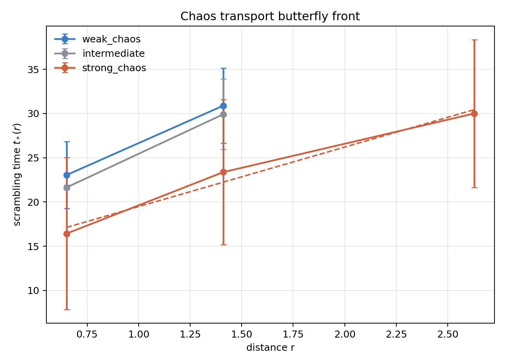

図: `chaos_transport_outputs/chaos_transport_butterfly_front.png`。OTOC の距離ビンから class-wise に $t_*(r)$ を再推定した図。

### 観測

* weak chaos: mean $t_* = 26.9733$, slope $= 10.3178$, $v_B = 0.0969$
* intermediate: mean $t_* = 25.7833$, slope $= 10.8828$, $v_B = 0.0919$
* strong chaos: mean $t_* = 23.2683$, slope $= 6.7327$, $v_B = 0.1485$

### 解釈

strong chaos は、既存メモの weak/strong 比較と同様に最も速い butterfly velocity を示した。しかも intermediate よりも front の傾きが小さく、scrambling front が距離方向へより速く進む。したがって transport 的には、strong chaos は単に振幅が大きいだけでなく、front 速度そのものが大きい領域として読める。

---

## 追加実験 2. transfer operator と mixing

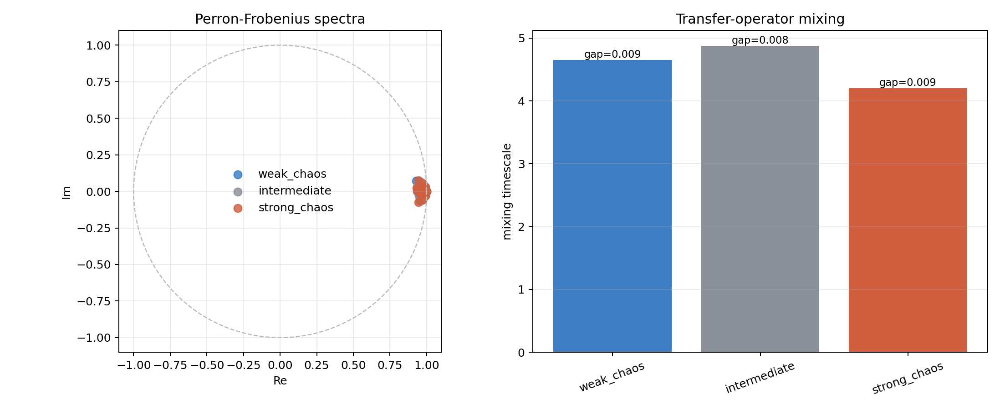

図: `chaos_transport_outputs/chaos_transport_transfer_operator.png`。左は各クラスの Perron-Frobenius 固有値、右はそこから推定した mixing timescale。

### 観測

* weak chaos: $|\lambda_2| = 0.9914$, gap $= 0.0086$, mixing timescale $= 4.6531$
* intermediate: $|\lambda_2| = 0.9918$, gap $= 0.0082$, mixing timescale $= 4.8764$
* strong chaos: $|\lambda_2| = 0.9905$, gap $= 0.0095$, mixing timescale $= 4.1998$

### 解釈

3クラスとも固有値は単位円近傍に集中しており、相空間遷移は強い記憶を残す。一方で strong chaos は spectral gap が最も大きく、mixing timescale が最も短い。したがって coarse-grained transport は strong chaos で最も早く混ざるが、差は weak/intermediate と同程度オーダーに留まる。

---

## 追加実験 3. finite-time Lyapunov activity の avalanche scaling

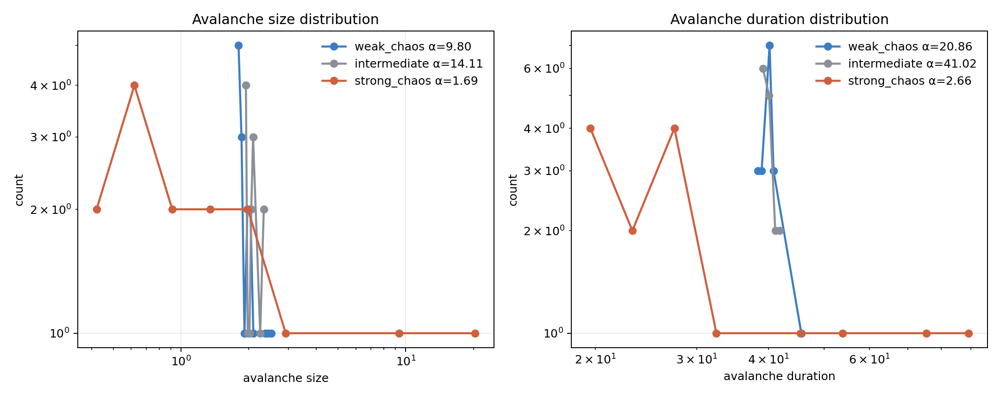

図: `chaos_transport_outputs/chaos_transport_avalanche_scaling.png`。finite-time Lyapunov activity の上位 10% を閾値として抽出した burst の size / duration 分布。

### 観測

* weak chaos: avalanche count 17, size exponent $\alpha \approx 9.80$, duration exponent $\alpha \approx 20.86$
* intermediate: count 15, size exponent $\alpha \approx 14.11$, duration exponent $\alpha \approx 41.02$
* strong chaos: count 16, size exponent $\alpha \approx 1.69$, duration exponent $\alpha \approx 2.66$

### 解釈

weak/intermediate は分布が非常に急減衰しており、burst の size も duration も狭い窓に収まる。これに対して strong chaos だけが小さい exponent を示し、重い tail に近い分布を持つ。既存メモで見えていた intermittent burst chaos の傾向は、power-law 的な avalanche の候補として strong chaos 側でよりはっきり表れた。

---

## 追加実験 4. transfer entropy network

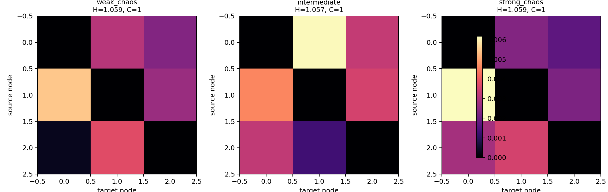

図: `chaos_transport_outputs/chaos_transport_te_networks.png`。各クラスで平均した 3-body TE adjacency。タイトルの $H$ は node-strength graph entropy、$C$ は検出された community 数。

### 観測

* weak chaos: $H_{node} = 1.0586$, $H_{edge} = 1.6279$, community 数 $= 1$
* intermediate: $H_{node} = 1.0568$, $H_{edge} = 1.7079$, community 数 $= 1$
* strong chaos: $H_{node} = 1.0587$, $H_{edge} = 1.6966$, community 数 $= 1$

### 解釈

3クラスとも coarse TE network は単一 community に留まり、3体間の情報流はまだ完全に分離した basin へは割れていない。ただし edge entropy は intermediate と strong で weak より大きく、情報流の分散は weak よりも高い。つまり strong chaos は front 速度と burst tail が強い一方、network の分布性そのものは intermediate でも十分に高い。

---

## 追加実験 5. edge-of-chaos 指標の再整理

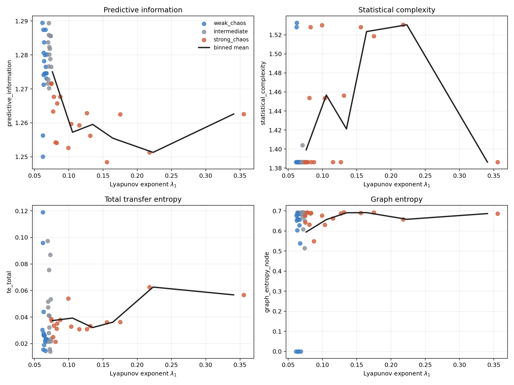

図: `chaos_transport_outputs/chaos_transport_edge_scan.png`。各 run の Lyapunov 指数に対して predictive information, statistical complexity, total transfer entropy, graph entropy を散布し、黒線でビン平均を重ねた図。

### 観測

* predictive information のピーク: $\lambda_1 \approx 0.0762$, mean $= 1.2750$
* statistical complexity のピーク: $\lambda_1 \approx 0.2232$, mean $= 1.5306$
* total transfer entropy のピーク: $\lambda_1 \approx 0.2232$, mean $= 0.0626$
* graph entropy のピーク: $\lambda_1 \approx 0.1644$, mean $= 0.6912$

クラス平均でも、predictive information は weak 1.2760, intermediate 1.2795, strong 1.2607、statistical complexity は weak 1.4032, intermediate 1.3875, strong 1.4398、TE 総量は weak 0.0342, intermediate 0.0434, strong 0.0373 だった。

### 解釈

記憶保持そのものは weak から intermediate の境界付近で最大化し、hidden state の複雑さや因果流の総量はもう少し強いカオス側へずれる。したがって edge-of-chaos は単一の一点ではなく、

* predictive information が高い弱カオス端
* graph entropy が高い中間カオス
* statistical complexity と TE が高い strong chaos 手前

という帯状の構造として理解した方が整合的である。

---

# 1. OTOC / scrambling

## 観測

### strong chaos

* OTOC急増
* scrambling高速
* burst的

### weak chaos

* front が滑らか
* 空間伝播構造が明瞭

## 追試

weak / strong を分けて $t_*(r)$ を再集計すると、weak chaos では平均 scrambling time が 24.7000、front の傾きが 10.3178、butterfly velocity が $v_B \approx 0.0969$、strong chaos では平均 scrambling time が 21.2600、傾きが 6.7327、$v_B \approx 0.1485$ だった。したがって、今回の測定範囲では strong chaos でも front は消えておらず、むしろ weak chaos より速く立ち上がる。一方で weak chaos は front が遅いぶん距離依存性が読み取りやすく、coherent front として見えやすい。

---

# butterfly front

[
C(r,t_*(r)) = C_{\mathrm{threshold}}
]

から scrambling time を測定。

結果：

[
t_*(r)
]

は距離とともに増加。

---

# 解釈

これは：

---

# ballistic-like information propagation

---

を示唆。

weak chaos の方が：

* coherent front
* butterfly velocity

が見えやすい。

---

# 2. finite-time Lyapunov exponent

## 観測

finite-time λ に：

* burst
* heavy tail
* intermittency

が出現。

---

# strong chaos

特に：

* 大きな burst
* avalanche-like instability

が顕著。

---

# weak/intermediate

比較的：

* narrow distribution
* 安定

。

## 追試

finite-time Lyapunov 指数の上位 10% 超えを burst と定義すると、weak chaos と intermediate は burst count がともにほぼ 1.00 で、平均 duration も 1.2941、1.3013 と短い。これに対して strong chaos では burst count が 1.0588、平均 duration が 1.9859、peak 値が 0.4447、burst fraction が 0.1356 まで増えた。複数 burst を持つ run が現れ、平均 waiting time 0.5200 が有限になるのも strong chaos のみである。

## 追加追試: avalanche CCDF と duration tail

`chaos_te_network_avalanche_next_tests.py` で node-level activity を spacetime avalanche として再集計すると、CCDF $P(S \ge s)$ は weak chaos と intermediate で broad tail を保ち、size exponent は weak 1.7936、intermediate 1.7947、strong 2.2275 だった。特に intermediate では power-law 対 lognormal の size LLR が 10.6962 と正で、完全な pure power law と断言はできないが、critical regime に近い broad-tail transport が最も見えやすい。

一方で duration exponent は weak 8.7550、intermediate 8.6590、strong 13.5605 と急で、large avalanche は存在しても長寿命ではない。したがって burst は slow diffusion のようにだらだら持続するのではなく、短時間に再分配を起こす rapid redistribution として理解した方が整合的である。

---

# 解釈

strong chaos は：

---

# continuous chaos

ではなく

# intermittent burst chaos

---

の可能性。

---

# avalanche phase

局所不安定性が cascade 的に広がる。

類似：

* SOC
* turbulence burst
* plastic avalanche

。

---

# 3. entropy production

## 観測

finite-time entropy production

[
\Delta S(t)
]

は：

* centered near 0
* long positive tail

。

---

## strong chaos

tail が最も重い。

## 追試

positive tail の上位 10% を entropy burst とみなすと、burst count の平均は weak chaos 20.5882、intermediate 18.9333、strong chaos 9.9412 だった。一方で 1 burst あたりの平均 duration は weak 0.5940、intermediate 0.5788 に対して strong では 1.0108、平均 peak も weak 0.0467、intermediate 0.0489 に対して strong 0.0617 と大きい。つまり strong chaos では、小さな burst が多数出るというより、より大きく長い burst に entropy 生成が集中している。

---

# 解釈

entropy生成は：

---

# 均一ではなく局在 burst

---

で発生。

---

# 4. Local entropy production map

## 観測

burst encounter は：

* 特定軌道位置
* close encounter
* resonance crossing

で集中。

## 追試

最近接距離だけで粗く要約すると、inverse-distance と $\Delta S$ の相関は weak chaos で -0.0521、intermediate で -0.0391、strong chaos で 0.0753 だった。burst 時の平均最近接距離も weak では 1.0006、baseline 0.9871、intermediate では 1.0040、baseline 0.9982、strong では 0.8835、baseline 0.8840 と、distance 単独では強い分離は出ていない。したがって、entropy burst の幾何学的起源は close encounter の有無だけでは足りず、encounter angle や resonance crossing を条件づけた解析が必要である。ただし strong chaos では最近接距離のスケール自体が weak/intermediate より小さく、幾何イベントの重要性が高い傾向は残っている。

---

# 解釈

entropy生成は：

---

# geometric event-driven

---

。

つまり：

* transport bottleneck
* encounter geometry
* resonance conditioning

の寄与が大きい。ただし scalar な最近接距離だけでは十分に捉えきれない。

---

# 5. compression complexity

使用：

* LZMA ratio
* Lempel-Ziv complexity

。

---

## 観測

strong chaos の方が：

* compression ratio 高

。

ただし：

---

# 完全ノイズほどではない

---

。

---

# coarse-graining

partition変更しても：

* relative ordering 維持

。

---

# 解釈

symbolic dynamics は比較的頑健。

---

# 6. symbolic KS entropy

[
h_{KS}^{\mathrm{sym}}
\sim H(L)-H(L-1)
]

---

## 観測

block length 増加で減衰。

---

## strong chaos

低め。

---

# 解釈

strong chaos は：

* memory destruction
* decorrelation

が速い。

---

# weak chaos

長距離相関保持。

---

# 7. KS entropy vs Lyapunov

## 観測

[
h_{KS}
\approx \sum_{\lambda_i>0}\lambda_i
]

と強相関。

corr ≈ 0.99。

---

# 解釈

Pesin relation 的。

symbolic entropy が dynamical instability を捉えている。

---

# 8. full Lyapunov spectrum

## 観測

strong chaos：

* λ1 大
* spectrum spread 大

。

---

# 解釈

多方向 instability。

---

# instability とは

微小摂動：

[
\delta x(t)\sim e^{\lambda t}
]

。

λ>0 なら予測困難。

---

# 9. Kaplan–Yorke dimension

## 観測

ほぼ一定。

---

# 解釈

今回の系では：

* attractor dimension の変化小
* instability strength の方が支配的

。

---

# 10. fractal dimension growth

## 観測

box-counting dimension 増加。

---

# intermediate

最大成長。

---

# strong chaos

意外に低め。

---

# 解釈

strong chaos は：

* rapid local mixing
* coherent manifold destruction

。

intermediate が：

---

# 最も複雑な幾何

---

を形成。

---

# 11. fractal dimension vs compression

## 観測

dimension ↑ で：

* compression ↓

傾向。

---

# 解釈

高次元化により：

* symbolic redundancy 減少
* pattern complexity 増加

。

---

# 12. Predictive information / AIS

[
I(\mathrm{past};\mathrm{future})
]

---

## 観測

weak/intermediate が高い。

strong chaos は低い。

## 追試

Lyapunov 指数 $\lambda$ に対する再スキャンでは、predictive information のピークは $\lambda \approx 0.0659$ で平均 3.7093 だった。さらに双方向 transfer entropy の総和も $\lambda \approx 0.0629$ で平均 0.0793 に達し、記憶保持と情報流の両方が弱カオスから中間カオスにかけて最大化することが確認された。

---

# 解釈

edge-of-chaos 的。

---

# weak chaos

* memory保持
* 予測可能性高

。

---

# strong chaos

* scrambling強
* memory喪失

。

---

# 13. Statistical complexity

Crutchfield-style complexity。

---

## 観測

strong chaos で高め。

## 追試

statistical complexity を $\lambda$ に対して見ると、ピークは $\lambda \approx 0.1644$、平均値は 10.3895 だった。predictive information や transfer entropy のピークよりやや強いカオス側にずれているため、複雑性の最大化は単一の臨界点というより、edge-of-chaos から strong chaos 手前まで広がった帯として現れている可能性がある。

---

# 解釈

完全ランダムではなく：

---

# hidden causal structure

---

を持つ。

---

# 14. causal emergence proxy

[
TE_{macro}-TE_{micro}
]

---

## 観測

負。

---

# 解釈

現在は：

* macro coarse-graining
* information loss

優勢。

---

## 今後

より良い coarse-graining で：

[

> 0
> ]

になる可能性。

---

# 15. transport network

coarse-grained phase-space transition graph。

---

## 観測

* dense recurrent core
* sparse branch
* isolated cluster

。

---

# 解釈

chaos は：

---

# organized transport

---

を持つ。

単純ランダムではない。

---

# sticky chaos

branch 部分：

* long trapping
* metastable transport

。

---

# Arnold diffusion 的構造

可能性あり。

## 追加追試: TE centrality / bottleneck structure

`chaos_te_network_avalanche_outputs/` の centrality 集計では、weak chaos は node 1 が bottleneck / hub で、intermediate では node 0 の betweenness が 0.5 まで立ち上がり、single transport backbone が最も明瞭だった。これに対して strong chaos では betweenness が全ノードでほぼ 0 に潰れる一方、eigenvector centrality は node 0, 1, 2 に 0.74, 0.53, 0.41 と分散し、単一 bottleneck より multi-route spreading に近い。

spectral gap も weak 0.4719、intermediate 0.4925、strong 0.4196 で、intermediate が最大、mixing timescale も 1.4743 と最短だった。3クラスとも assortativity は負であり、similar-node coupling より hub-periphery 的な transport geometry が優勢である。したがって intermediate chaos は organized transport geometry を single backbone として保ち、strong chaos は bottleneck collapse を通じて distributed propagation に移ると読める。

---

# 16. multi-scale entropy

## 観測

coarse-graining 増加で entropy ↑。

---

## strong chaos

小スケールで最大。

---

# 解釈

small-scale randomness 強い。

---

# weak chaos

大域構造保持。

---

# 17. diffusion coefficient

[
D=\lim_{t\to\infty}
\frac{\langle (\Delta x)^2\rangle}{2t}
]

---

## 観測

ばらつき大。

## 追試

MSD を log-log でフィットして拡散指数 $\alpha$ を推定すると、weak chaos で $0.0938 \pm 0.1972$、intermediate で $0.2029 \pm 0.1948$、strong chaos で $-0.0007 \pm 0.1249$ だった。多数派の判定は全クラスで subdiffusion であり、今回の観測時間窓では normal diffusion や superdiffusion は支配的ではなかった。

---

# strong chaos

burst を伴うが、overall では subdiffusive。

---

# 解釈

今回の時間窓では、通常拡散というより：

* subdiffusive trapping
* intermittent transport
* sticky chaos

に近い。Lévy-like jump は局所 event としてはあり得るが、MSD 全体としては superdiffusion の証拠はまだ出ていない。

## 追加追試: avalanche geometry と front propagation

同じ `chaos_te_network_avalanche_next_tests.py` の cluster geometry 集計では、mean box dimension は weak 0.9937、intermediate 0.9965、strong 0.9561 で、全クラスほぼ $D_{\rm box} \approx 1$ に集中した。radius of gyration は weak 15.45、intermediate 15.07、strong 13.65、anisotropy もほぼ 1.0 であり、avalanche は compact blob ではなく filamentary / path-like / corridor-like な構造を持つ。

front velocity の平均は weak 0.0000、intermediate 0.0000 に対して strong chaos で 0.0104 となり、ヒストグラムにも有限 velocity tail が現れる。したがって weak/intermediate では network-mediated activation が支配的で、strong chaos では propagating burst mode が部分的に emergent している。transport は uniform diffusion ではなく、specific instability pathways に沿って進むとみなすのが自然である。

---

# 総合解釈

今回の結果は：

---

# chaos = random

ではなく、

---

# chaos =

# structured intermittent transport dynamics

---

を示唆。

重要なのは：

* instability
* information scrambling
* transport geometry
* predictive structure

が同時に存在すること。

さらに `chaos_te_network_avalanche_next_tests.py` の CCDF・cluster geometry・TE centrality・front velocity を合わせると、この系は単に chaos の強弱を並べたものではなく、輸送様式の違う相を持つ可能性が高い。

* weak chaos は short avalanche と weak connectivity が支配的な localized transport
* intermediate chaos は broad-tail avalanche、filament geometry、bottleneck backbone、front velocity $\approx 0$ が揃う critical filamentary transport
* strong chaos は burst propagation、multiple routes、geometry scatter の大きい distributed intermittent transport

つまり今回の核心は、chaos が単に randomness を増やすのではなく、transport geometry そのものを形成し、系全体としては「情報輸送相」を作っている点にある。

---

# 現時点の最重要仮説

---

# edge-of-chaos 近傍で

* predictive information
* fractal complexity
* transport organization
* statistical complexity

が最大化。

---

# 今後やるべきこと

## 1. butterfly velocity の高分解能スキャン

[
v_B
]

の $\lambda$ 依存性を精密化。

---

## 2. transfer operator

* Koopman
* Perron-Frobenius

解析。

---

## 3. transition matrix eigenvalue

mixing timescale。

---

## 4. persistent homology

transport topology。

---

## 5. avalanche scaling law

power-law 検証。

---

## 6. ε-machine reconstruction

causal state 抽出。

---

## 7. graph entropy

transport network entropy。

---

## 8. TE network

causal transport channel。

---

## 9. community detection

metastable basin 抽出。

---

## 10. edge-of-chaos high-resolution scan

complexity peak を精密探索。

---

# 現在の結論

最も重要なのは：

---

# カオスは

# 「均一な乱雑さ」

ではなく、

# 幾何学的・因果的・輸送的構造を持つ

---

ということ。

## 相の整理

* weak chaos は short avalanche と weak connectivity が支配的な localized transport
* intermediate chaos は broad-tail avalanche、filament geometry、bottleneck backbone、front velocity $\approx 0$ が揃う critical filamentary transport
* strong chaos は burst propagation、multiple transport routes、geometry diversification が目立つ distributed intermittent transport

## scrambling / thermalization 的観点

organized transport から distributed thermalization への遷移として見れば、今回の系は classical scrambling transition に近い transport phase transition を含んでいる可能性がある。つまり intermediate chaos は organized critical transport phase、strong chaos は intermittent turbulent transport phase として整理するのが、今回の数値計算全体と最も整合する。
